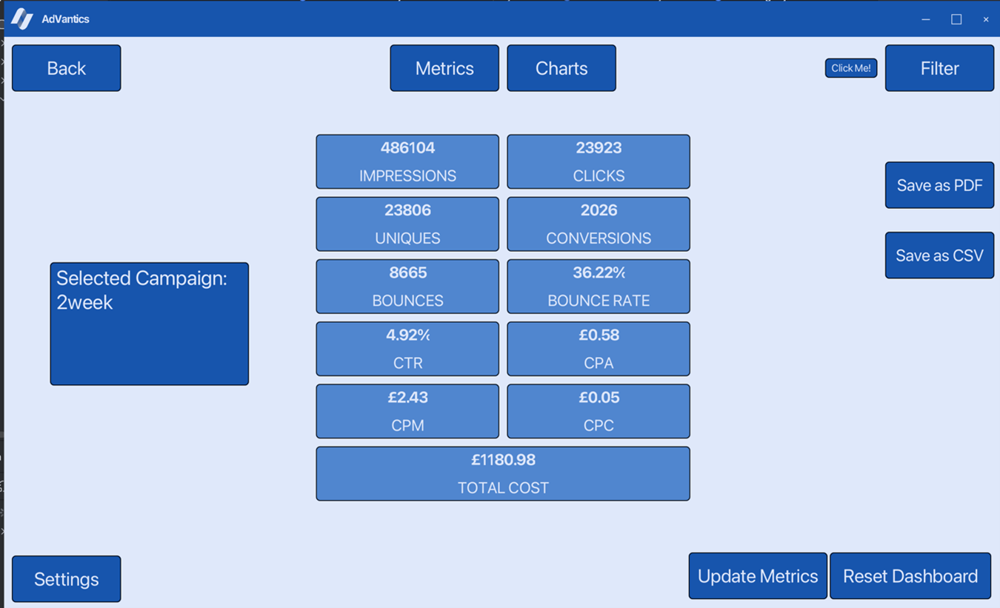

# AdVantics (Advertising Analytics Dashboard)
Our project from COMP2211 - Software Engineering Group Project.

JavaFX analytics dashboard for an online marketing agency, featuring interactive data visualisation (CTR, CPA, CPM), filtering, and user authentication for multi-user collaboration.

### Login:

### New Campaign:

### Select Campaign:

### Metrics: 

### Charts + Export PDF: 

### Chart Filtering: 

### Settings: 

